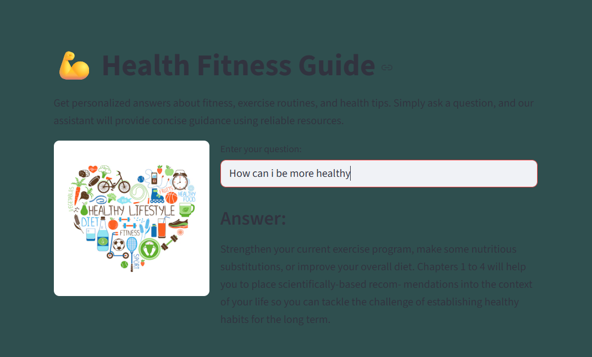
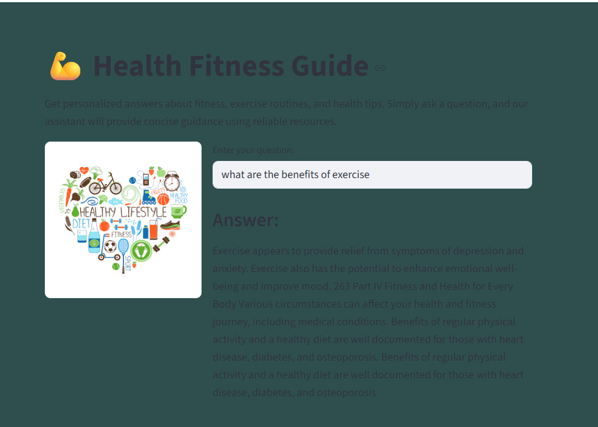
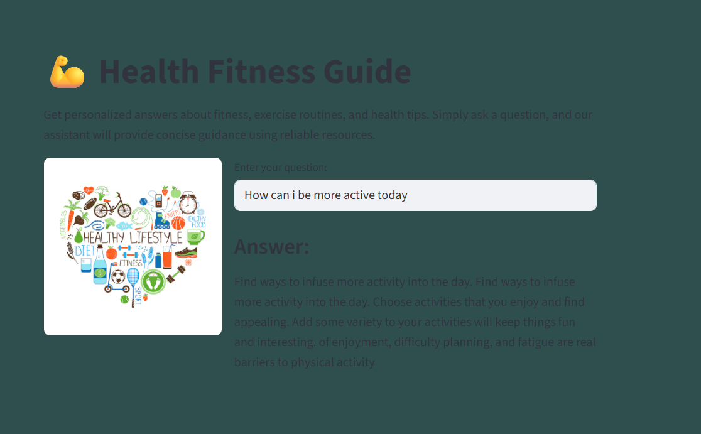

# My-first-Rag-project
# Phase-1-project-
# 💪 Health Fitness Guide
 

An interactive question-answering app where users can query fitness and health-related resources (TXT transcripts + PDF documents). The app retrieves the most relevant sections from your dataset and generates concise, context-aware answers using a local Hugging Face model.  

---

## 🚀 Tech Stack  

- [Streamlit](https://streamlit.io/): for the user interface  
- [LangChain](https://www.langchain.com/): for prompt templates and chaining  
- [Hugging Face Transformers](https://huggingface.co/): local model inference (google/flan-t5-small)  
- [FAISS](https://github.com/facebookresearch/faiss): vector store for fast similarity search  
- Python 3.9+

---

## ⚙️ Setup Instructions  

1. Clone this repository  
   ```bash
   git clone [https://github.com/your-username/fitness-info-hub.git](https://github.com/Noah-Liknaw/Phase-1-project-)
   cd Phase-1-project
2. Create a virtual environment
python -m venv venv
source venv/bin/activate   # On Linux/Mac
venv\Scripts\activate      # On Windows

3.Install dependencies
pip install -r requirements.txt

4.Add your data
Place your .txt and .pdf files inside the data/ folder.
Example:
data/
├── health_pdf1.pdf
├── health_pdf2.pdf
├── fitness_tips.txt
├── workout_guides.txt
└── nutrition.txt

5.Build the vectorstore

python src/retrieve.py

6.Run the app

streamlit run src/app.py


💡 Example Queries & Answers

Below are some screenshots showing how the app responds to fitness-related questions:

Example 1:



Example 2:


Example 3:


**Live Link**
https://healthandfitnessai.streamlit.app/
